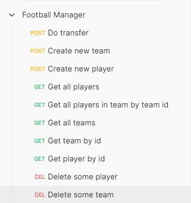

## **FootBall Manager**

### About

This is an API that  gives you the opportunity to be a football manager.

### How to Run

- Install Lombok plugin (or replace all @Data annotations with getters, setters and toString)
- Run 'FootballManagerApplication' class
- Use Postman to test how it works

    - Import postman collection using this [link](https://www.getpostman.com/collections/8eed88238774c611c62f)  

      
- DataBase injection happens in config/DataFiller class. You can create some custom teams and players there
- You can use H2-DB to work with Data Base, url = `http://localhost:8080/h2-console/`
, `passord = 'password'`, see application.properties
### Available endpoints:

- `http://localhost:8080/transfers/` - transfer operation, post mapping

Request example:
`{"buyerId":2,"sellerId":1,"playerId":1}`

Explanation in this case:

buyerId = Barcelona team,

sellerId = Real Madrid team,

playerId = Cristiano Ronaldo player.

(Check DataFiller class, path - `src/main/java/footballmanager/config/DataFiller`)

  
### Technologies used

- Java 11
- SpringBoot
- Spring JPA
- Spring Web / MVC  
- Hibernate
- H2 DB

Postman collection link: https://www.getpostman.com/collections/8eed88238774c611c62f

